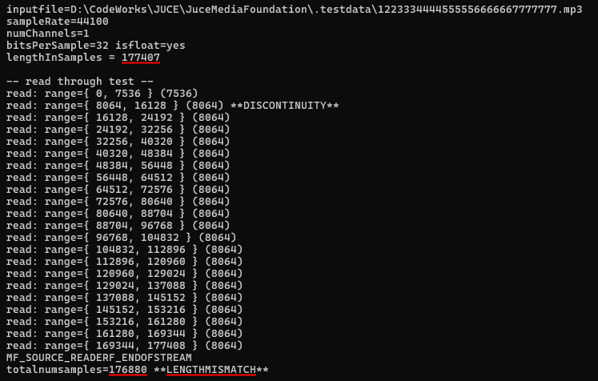
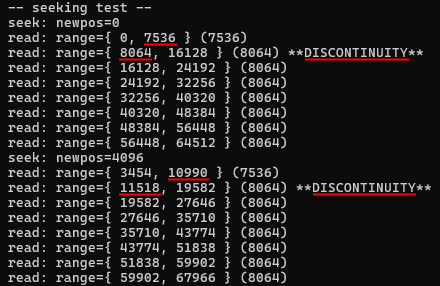
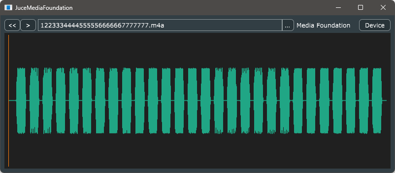

# JuceMediaFoundation

## 目次
- [1. 動機と目的](#1-動機と目的)
- [2. 実験: TestMFSourceReader](#2-実験-testmfsourcereader)
  - [2.1. メディア長さの不一致](#21-メディア長さの不一致)
  - [2.2. 不連続なタイムスタンプ](#22-不連続なタイムスタンプ)
  - [2.3. 不適当なシーク](#23-不適当なシーク)
  - [2.4. 実験の結果](#24-実験の結果)
- [3. 実用的な実装: JuceMediaFoundation](#3-実用的な実装-jucemediafoundation)
- [4. 結び](#4-結び)
- [Written by](#written-by)
- [License](#license)

## 1. 動機と目的

JUCEにはWindowsMediaAudioFormatクラスが用意されている。これはWindows Media Format SDK (WMFSDK)を利用しており、Windowsプラットフォームがサポートする多くのメディアフォーマットを扱うことが出来るが、Windows 10以降に追加された新しいコーデックはMedia Foundation Transform (MFT)として提供されており、WMFSDKではサポート出来ない。そこで、より新しいMedia Foundation APIを使った自前のAudioFormatクラスの実装を試みた。  
AudioFormatの形にするためには、サンプル精度でのシーク能力が必要になるが、いくつかの問題に突き当たった。

- 不正確なメディア長さ
- 不正確なタイムスタンプ
- 不適当なシーク

これらの挙動はメディアフォーマットによって異なるようだった。そこで、実験により上手く動作するメディアフォーマットを探求し、最終的に実用的なMediaFoundationAudioFormatクラスを実装した。

## 2. 実験: TestMFSourceReader

この小さなプログラムはMedia Foundation APIの提供するMFSourceReaderを使ってメディアファイルを開き、その挙動を検証する。

- メディアファイルを開いて、フォーマットやメディア長さを正しく取得できるか
- サンプルのタイムスタンプが正しく取得できているか
- シーク後の実際の位置は適正か

### 2.1. メディア長さの不一致

プレゼンテーション属性から取得したメディア長さと、読み出したサンプル数の合計が食い違うことがある。

### 2.2. 不連続なタイムスタンプ

連続してサンプルバッファを読み出したとき、取得したタイムスタンプが不連続になることがある。

### 2.3. 不適当なシーク

MFSourceReaderはサンプル精度のシークを保証していないので、シークした後に望みの位置にストリームを進める必要がある。そのため、ストリームをシークしたとき実際の位置が指定した位置と同じかそれより前であることが望ましい。しかし実際にはそれよりも後になることがある。

### 2.4. 実験の結果

|media format|length mismatch|discontinuity|improper seeking|
|-|-:|-:|-:|
|FLAC|😡|😊|😡|
|AAC (.m4a, .mp4)|😊|😊|😊|
|ALAC (.m4a)|😡|😡|😡|
|MP3|😡|😡|😊|
|WAV|😊|😊|😊|

AAC (m4a, mp4)での動作は良好であった。その他のフォーマットはJUCEに既にあるクラスに任せるのが良さそうだ。

## 3. 実用的な実装: JuceMediaFoundation

実験を踏まえて、より実用的なMediaFoundationAudioFormatクラスを試作して単純なアプリケーションに組み込んだ。このアプリケーションはJUCE 7.0.8を利用して作成され、波形サムネイルとプレイバックの為にそれぞれAudioFormatReaderクラスを利用する。  MediaFoundationAudioFormatクラスにはAAC (.m4a, .mp4)フォーマットだけを担当させるようにしたが、同じ.m4a拡張子を持つALACフォーマットではうまく動作しないことがわかっている。

## 4. 結び

労多くして功少なし。

## Written by

[yu2924](https://twitter.com/yu2924)

## License

CC0 1.0 Universal
