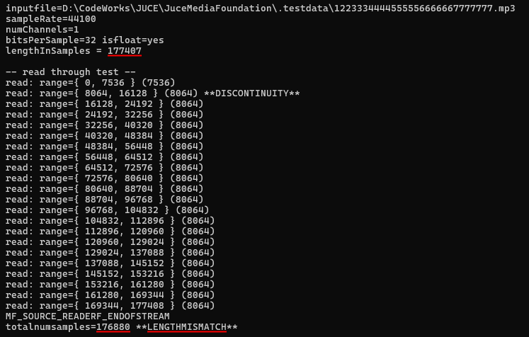
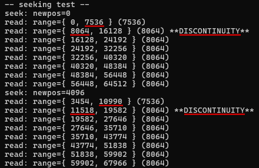
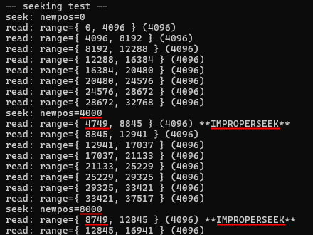
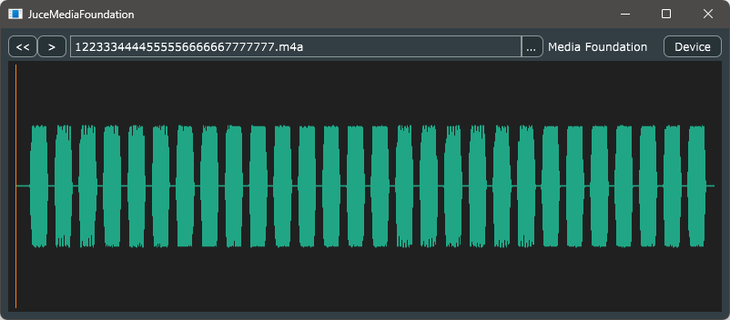

# JuceMediaFoundation

## Table of Contents
- [Table of Contents](#table-of-contents)
- [1. Motivation and Objective](#1-motivation-and-objective)
- [2. The experiment: TestMFSourceReader](#2-the-experiment-testmfsourcereader)
  - [2.1. Media length mismatch](#21-media-length-mismatch)
  - [2.2. Timestamp discontinuity](#22-timestamp-discontinuity)
  - [2.3. Improper seeking](#23-improper-seeking)
  - [2.4. Results of the experiments](#24-results-of-the-experiments)
- [3. The practical implementation: JuceMediaFoundation](#3-the-practical-implementation-jucemediafoundation)
- [4. Conclusion](#4-conclusion)
- [Written by](#written-by)
- [License](#license)

## 1. Motivation and Objective

JUCE provides the WindowsMediaAudioFormat class. It uses the Windows Media Format SDK (WMFSDK) and can handle many of the media formats supported by the Windows platform, but newer codecs added in Windows 10 and later are provided as Media Foundation Transform (MFT), so the WMFSDK cannot support them. Therefore, I tried to implement my own AudioFormat class using the newer Media Foundation API.  
In order to get the AudioFormat form, it requires the ability to seek with sample precision, but I encountered some problems.

- inaccurate media length
- inaccurate timestamps
- improper seek

These behaviors seemed to vary depending on the media format. So I did some experiments to find media formats that worked well, and finally, I implemented practical MediaFoundationAudioFormat class.

## 2. The experiment: TestMFSourceReader

This small program uses the MFSourceReader provided by the Media Foundation API to open media files and examine their behavior.

- whether the media file can be opened, and the format and media length can be retrieved correctly
- whether the timestamp of the sample buffer can be obtained correctly
- whether the actual position after the seek is appropriate

### 2.1. Media length mismatch

There may be a mismatch between the media length obtained from the presentation attribute and the total number of samples read out.

### 2.2. Timestamp discontinuity

When reading sample buffers successively, the timestamps obtained may be discontinuous.

### 2.3. Improper seeking

Since the MFSourceReader does not guarantee sample-accurate seek, it is necessary to advance the stream to the desired position after seek. Therefore, it is desirable that the actual position after seeking the stream is the same as or earlier than the specified position. However, the actual position may be later than that.

### 2.4. Results of the experiments

|media format|length mismatch|discontinuity|improper seeking|
|-|-:|-:|-:|
|FLAC|😡|😊|😡|
|AAC (.m4a, .mp4)|😊|😊|😊|
|ALAC (.m4a)|😡|😡|😡|
|MP3|😡|😡|😊|
|WAV|😊|😊|😊|

It works well with AAC (m4a, mp4). Other formats seem to be better handled by the classes already in JUCE.

## 3. The practical implementation: JuceMediaFoundation

Based on the experiments, I prototyped a more practical MediaFoundationAudioFormat class and integrated it into a simple application. This application was created using JUCE 7.0.8 and uses the AudioFormatReader class for waveform thumbnails and playback, respectively.  
The MediaFoundationAudioFormat class handles only the AAC (.m4a, .mp4) format, but I have found that it does not work well with the ALAC format, which has the same .m4a extension.

## 4. Conclusion

All pain and no gain.

## Written by

[yu2924](https://twitter.com/yu2924)

## License

CC0 1.0 Universal
